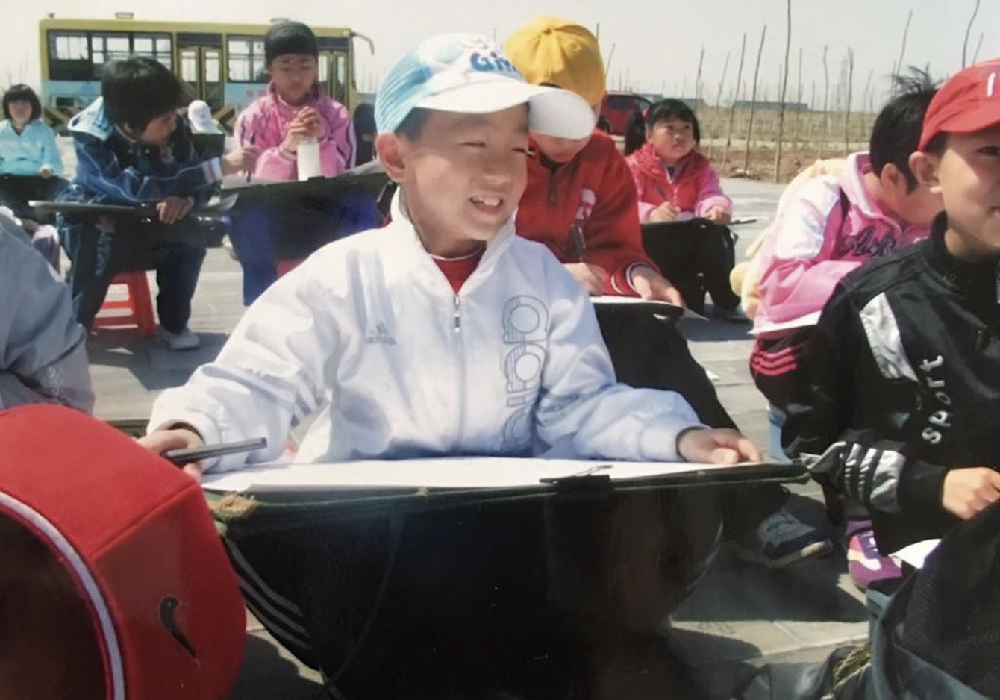

# hw01: Self-Introduction
My name is **Xuefei Gao** and you can just call me **Ian**, which is easier to pronounce and remember. I am a raising second year and I plan to major in Math and Econ. I am also a fellow of SISRM and I am going to work with Professor Susan Stokes this summer.

Here are some of my interests:
1. Music
  *Rock
  *Classical
2. Basketball
3. Sneakers

Here is my homepage of Github: https://github.com/IanGGG